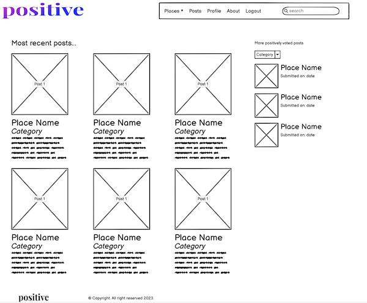
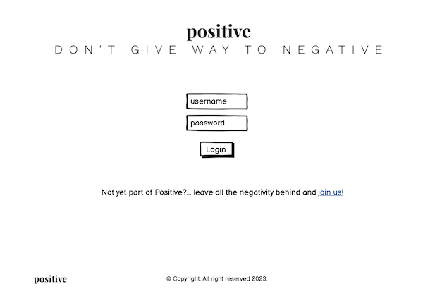
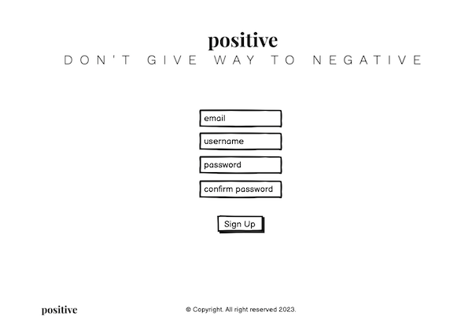
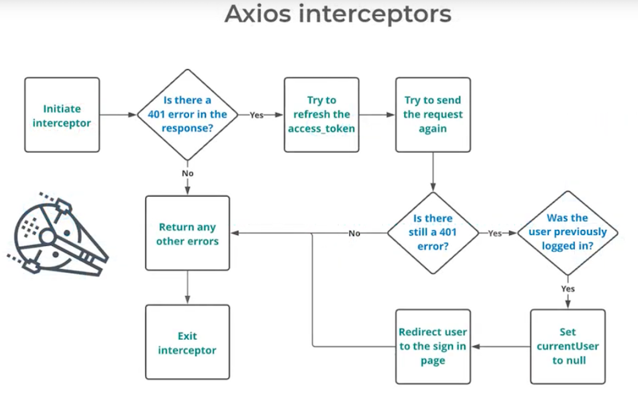

# THE POSITIVE SOCIAL NETWORK


## Table of Contents

- [Introduction](#introduction)
- [Starting the React App](#starting-the-react-app)
- [Creating the Navbar component](#creating-the-navbar-component)
- [Creating the Footer component](#creating-the-footer-component)
- [Creating the Home component](#creating-the-home-component)
- [Creating the 404 - Not Found component](#creating-the-404---not-found-component)
- [Deploying the React app in Heroku](#deploying-the-react-app-in-heroku)
- [Adding the Bootstrap library](#adding-the-bootstrap-library)
- [Creating the Login component](#creating-the-login-component)
- [Creating the SignUp component](#creating-the-signup-component)
- [Creating the Dashboard (Home) component](#creating-the-dashboard-home-component)
- [Creating the PostCard component](#creating-the-postcard-component)
- [Creating the CurrentUser context](#creating-the-currentuser-context)
- [Creating the Interceptors](#creating-the-interceptors)

## Introduction

Welcome,

This project is a React App for the Positive Social Network Front-End, a social network for people to share only positive reviews of restaurants, bars, hotels, etc. Why only positive reviews? Because we want to create a positive environment for people to share their experiences and recommendations. We believe that there are already too many negative reviews on the internet, and we want to change that.

In my experience as a movie and music reviewer, people feel also attracted to check the negatively scored movies. We humans are curious by nature, and we want to know why a movie is so bad, or why a restaurant is so bad. We even want to contradict others opinions, so we also want to prove people wrong. This is why I believe that a social network with only positive reviews will be a success. Not only because really good places will have more notoriety, but also because people won't have information about bad places, so these places will need to strive harder to at least, have presence in the Internet.

Also, when one writes a negative review, it is very easy to get carried away and write a very long one, losing even scope. But, when one writes a positive review, needs to really focus on explaining why the place is so good, and this is a good exercise for the brain and also, to hihglight why the place is worth visiting.

## Starting the React App

To start the React app, you need first to create the repository and runing the following command in the terminal:

```bash
npx create-react-app . --use-npm
```

After that, you should see the React app running on port 3000. You can access it by clicking on the "Preview" button on the top of the IDE.

## Creating the Navbar component

React works with components. Components are reusable pieces of code that can be used to build elements of the UI.

To create a component, you need to create a new file in the `src` folder. The file name should start with a capital letter, and it should have the `.jsx` extension. For example, `NavBar.jsx`.

In the file, you need to import React and export the component. You can do that by adding the following code:

```js
import React from "react";

export default function NavBar() {
  return <div>NavBar</div>;
}
```

To use the component, you need to import it in the `App.js` file. You can do that by adding the following code:

```js
import NavBar from "./NavBar";
```

Then, you can use the component in the `App.js` file by adding the following code:

```js
<NavBar />
```

## Creating the Footer component

To create the Footer component, you can follow the same steps as for the NavBar component.

## Creating the Home component



Before creating the rest of the components, we need to create the routes.

Routes are used to define which component should be rendered when a user visits a specific URL. For example, if a user visits the `/` URL, the Home component should be rendered. If a user visits the `/about` URL, the About component should be rendered. So, in React, the page is not reloaded, but the component is changed or rendered.

**PREVIOUS STEP:** We need to import the container component into the `App.js` file. You can do that by adding the following code:

```js
import Container from "react-bootstrap/Container";
```

And then, you can use the component in the `App.js` file by adding the following code:

```js
<NavBar />
<Container>
    <Home />
    <Footer />
</Container>
```

To create the routes, we need to install the `react-router-dom` package. You can do that by running the following command in the terminal:

```bash
npm install react-router-dom
```

After that, we need to import the `BrowserRouter` component in the `App.js` file. You can do that by adding the following code:

```js
import { BrowserRouter as Router } from "react-router-dom";
```

And then, we need to wrap our app with the `Router` component. You can do that by adding the following code:

```js
<Router>
  <App />
<Router>
```

**_SUPER IMPORTANT:_** The React Router version in the tutorial is not the same as the one we are using. So, you need to change the code a little bit. For example: Switch has been deprecated and replaced with Routes. You can read more about the changes here: https://reactrouter.com/docs/en/v6/upgrading/v5

Feel free to check the code in the App.js file to see how it should look like.

**NOTE:** If you are getting errors, remember that you are using a template. Therefore, some version would need to be updated in the package.json file. Just change the version to the latest one or the one you need and run `npm install` again.

## Creating the 404 - Not Found component

Actually, it is not a component. It is just a page that will be rendered when a user visits a URL that does not exist. For example, if a user visits the `/about` URL, the About component should be rendered. But, if a user visits the `/about123` URL, the 404 - Not Found page should be rendered.

It is just a function in the App.jsx that returns a message. You can create it by adding the following code:

```js
<Route path="*" element={<NotFound />} />

...

function NotFound() {
  return (
    <>
      <h1>404 - Page Not Found</h1>
      <p>Sorry, the page you are looking for could not be found.</p>
    </>
  );
}
```

## Deploying the React app in Heroku

To deploy the React app in Heroku, you need to create a new app in Heroku. You can do that by following the steps below:

1. Go to https://dashboard.heroku.com/apps
2. Click on the "New" button and select "Create new app"
3. Enter the app name and click on the "Create app" button

After that, you need to connect the Heroku app with the GitHub repository. You can do that by following the steps below:

1. Go to the "Deploy" tab
2. Select "GitHub" as the deployment method
3. Search for the repository name and click on the "Connect" button

After that, you need to deploy the app. You can do that by following the steps below:

1. Go to the "Deploy" tab
2. Click on the "Deploy Branch" button

Basically, it is the same as with the API project. You can check the previous readme files for more information.

## Adding the Bootstrap library

To add the Bootstrap library, you need to install the `react-bootstrap` package. You can do that by running the following command in the terminal:

```bash
npm install react-bootstrap
```

After that, you need to import the Bootstrap CSS file in the `index.js` file. You can do that by adding the following code:

```js
import "bootstrap/dist/css/bootstrap.min.css";
```

But, we have decided to use it in a different way. We have decided to import the Bootstrap components in the components where we need them. For example, if we need the `Container` component, we will import it in the `App.js` file. If we need the `Button` component, we will import it in the `Home.js` file.

This way, we will have a better overview of which components we are using in which files.

## Creating the Login component



To create the Login.jsx component, we have used a Bootstrap form. You can read more about it here: https://react-bootstrap.github.io/components/forms/

There is something imprtant compared with the tutorial, and it is the 'useNavigate' hook. You can read more about it here: https://reactrouter.com/docs/en/v6/api#usenavigate . Basically, it is used to navigate to a different page, but, in the tutorial, they are using the 'useHistory' hook. You can read more about it here: https://reactrouter.com/docs/en/v6/api#usehistory . The difference is that the 'useNavigate' hook is used in React Router v6, and the 'useHistory' hook is used in React Router v5.

Also, at the time of using it, it differs a little:

```js
// React Router v5
import { useHistory } from "react-router-dom";

// React Router v6
import { useNavigate } from "react-router-dom";
```

The following naming is optional:

```js
// React Router v5
const history = useHistory();

// React Router v6
const navigate = useNavigate();
```

```js
// React Router v5
history.push("/");

// React Router v6
navigate("/");
```

## Creating the SignUp component



To create the SignUp component, you can follow the same steps as for the Login component.

## Creating the Dashboard (Home) component


The idea of the webpage, is that the non-registered user will only see a splash screen in which it is invited to make part of the community. The registered user is invited to log in. And the logged in user will see the dashboard (Home) component.

In this page, the user will see the list of the posts. The posts will be fetched from the API and will be listed from newer to older.

Also, it is worth noting that the NavBar is available only for the logged in user. The non-registered user and the registered user will not see the NavBar.

## Creating the PostCard component

## Creating the CurrentUser context

We are using axios to make the API calls. You can read more about it here: https://www.npmjs.com/package/axios. Basically, it is a library that allows us to make HTTP requests. Therefore, we can use it to make GET, POST, PUT, and DELETE requests.

We have also created the CurrentUser context as a sepparate component, so we can reuse it in other components, such as the Login, NavBar and SignUp.

And we are retrieving the user data and storing it in the following code:

```js
const handleMount = async () => {
  try {
    const { data } = await axios.get("dj-rest-auth/user/");
    setCurrentUser(data);
  } catch (error) {
    console.log(error);
  }
};
```

**NOTE: ** as you now from the API project, we are using the dj-rest-auth package to handle the authentication.

## Creating the Interceptors

As we are using JWT (JSON Web Tokens), we need to check if they have expired or not everytime a user wants to use the webpage. These tokens have a validity of 5 minutes, so without the proper configuration, the user will need to log in everytime that he/she opens the page. With Axios, we can intercept requests or responses before they are handled by then or catch. So, we can check the validity of the token before the request is made. If the token is expired, we can redirect the user to the login page or, much better, we can refresh the token and then make the request.

You can read more about it here: https://www.npmjs.com/package/axios#interceptors

The logic is the following:



*Image taken from the CI tutorial*

The code can be found in the axiosDefaults.js file, and the CurrentUserContext.jsx file.


## Creating the About component

To create the About component, you can follow the same steps as for the Home component.

## Creating the CreatePlace component

As the porpuse of all projects is to practice, we have decided to use a different approach to create the CreatePlace component. In this case, a not so efficient one, but easier to understand for the students.

**NOTE: ** I would like that my projects could help future students understanding different approaches and the whys.

There is an interesting part of this component, and it is the use of a third party resource:

https://countriesnow.space/api/v0.1/countries

This resource is used to get the list of countries and their cities. We are using it to populate the country and city fields in the form.

We have decided to part ways (momentarily) with our cities-light library, because:

1. The DB is filled with 44MB of data, and the free tier of turtleDB only allows 20MB.
2. The DB proved to have some format issues, which interfere with different languages setups, and we don't want to have this kind of issues in a project meant to be used worldwide.
3. The fixing of all these issues would take a lot of time, and we want to focus on the React part of the project.
4. As this solution is derived from a lookup table, unless it is updated, there will be no chance of corruption in ours. But, it is recommended to check from time to time the consistency of the data.
*RECOMMENDATION:* make a select distinct country from places_table and check the number of countries, and compare with the previous dump.

## Creating the PlaceDetail component

## Creating the CreatePost component

For this one, we have used the approach used in the Moments tutorial.

