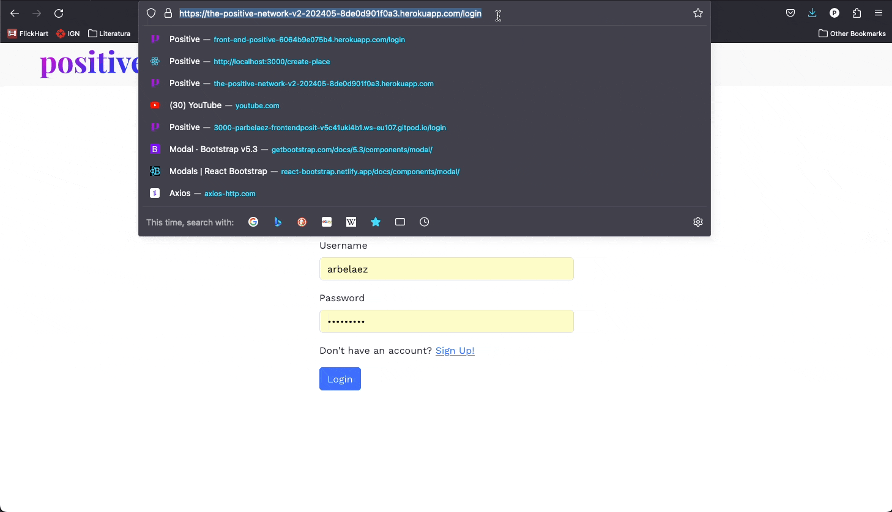
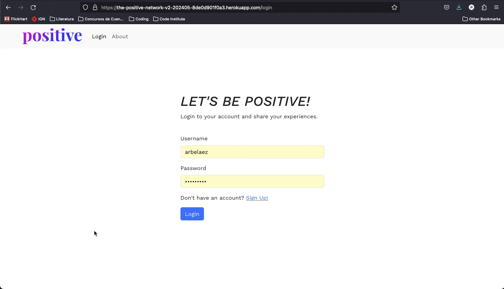
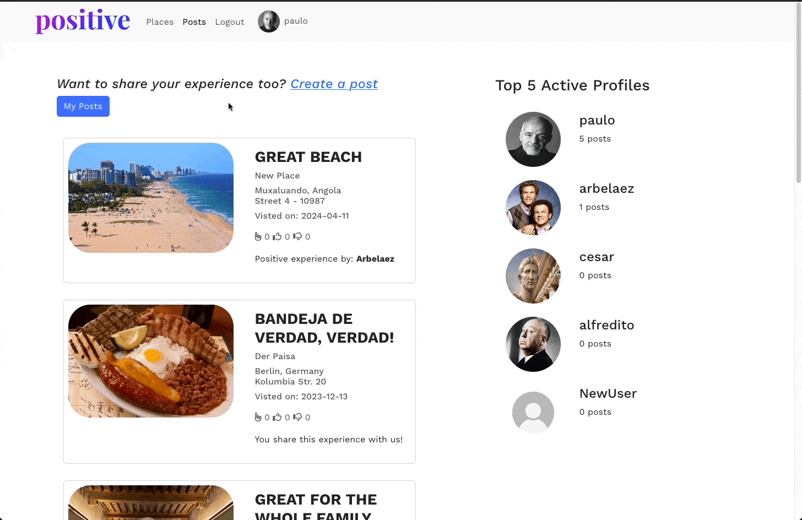
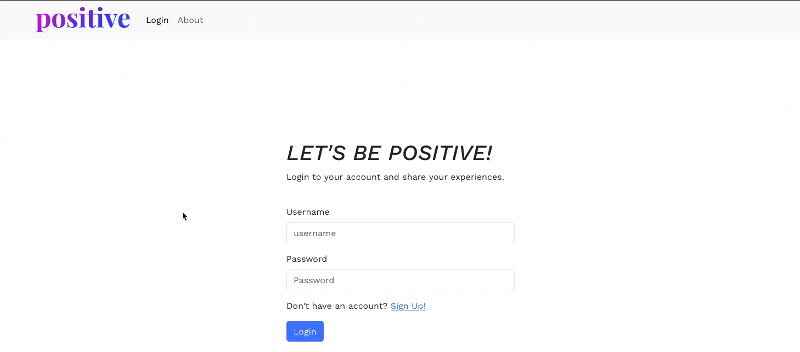
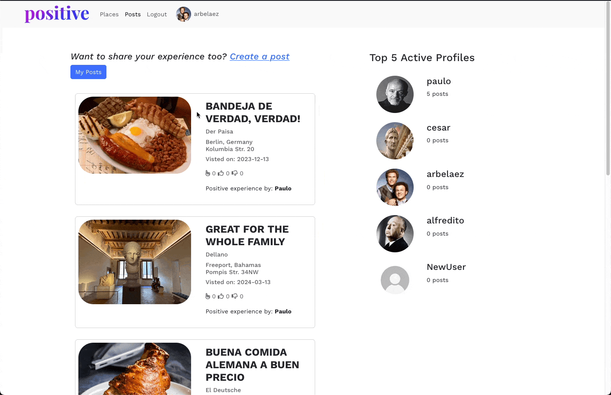
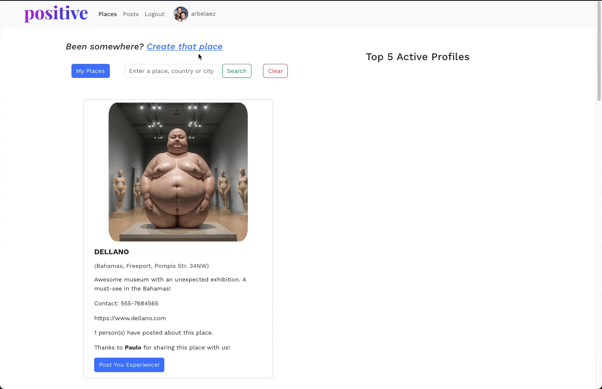
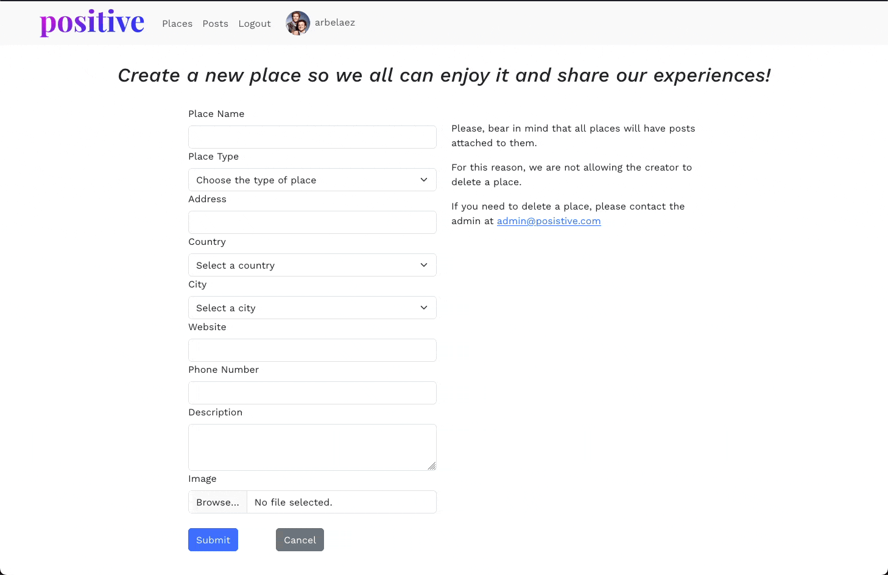
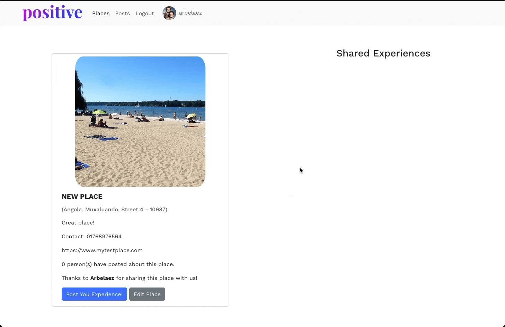
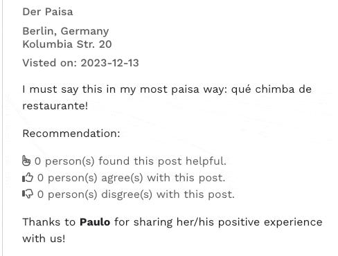

# THE POSITIVE SOCIAL NETWORK


## Table of Contents

- [Introduction](#introduction)
- [Starting the React App](#starting-the-react-app)
- [Creating the Navbar component](#creating-the-navbar-component)
  - [Using Bootstrap as a base](#using-bootstrap-as-a-base)
- [Creating the Home component](#creating-the-home-component)
- [Creating the 404 - Not Found component](#creating-the-404---not-found-component)
- [Deploying the React app in Heroku](#deploying-the-react-app-in-heroku)
- [Adding the Bootstrap library](#adding-the-bootstrap-library)
- [Creating the Login component](#creating-the-login-component)
- [Creating the SignUp component](#creating-the-signup-component)
- [Creating the CurrentUser context](#creating-the-currentuser-context)
- [Creating the Interceptors](#creating-the-interceptors)
- [Creating the CreatePlace component](#creating-the-createplace-component)
- [Creating the Places page](#creating-the-places-page)
  - [The Search bar](#the-search-bar)
  - [The My Places filter button](#the-my-places-filter-button)
- [Creating the PostCard component](#creating-the-postcard-component)
  - [The likes criteria](#the-likes-criteria)
- [Infinite scroll](#infinite-scroll)
- [Version 2 desired features](#version-2-desired-features)
- [Bugs](#bugs)
  - [CI Moments Code's Bugs](#ci-moments-codes-bugs)
    - [Current User is lost after a refresh](#current-user-is-lost-after-a-refresh)
    - [The hamburger menu closes before the link is clicked](#the-hamburger-menu-closes-before-the-link-is-clicked)
    - [No real like calculation is seen in the posts](#no-real-like-calculation-is-seen-in-the-posts)
    - [Refresh token messages DOS](#refresh-token-messages-dos)
  - [Normal Bugs](#normal-bugs)
    - [The modal is not displayed after the user cancels the deletion (fixed)](#the-modal-is-not-displayed-after-the-user-cancels-the-deletion-fixed)
    - [When the profile is being updated, if the user cancels the edition after writing, the data is not reset to the previous one (pending)](#when-the-profile-is-being-updated-if-the-user-cancels-the-edition-after-writing-the-data-is-not-reset-to-the-previous-one-pending)
    - [The current user is lost sometimes messing with the "My Post" filter and posts owner (pending)](#the-current-user-is-lost-sometimes-messing-with-the-my-post-filter-and-posts-owner-pending)

## Introduction

Welcome,

This project is a React App for the Positive Social Network Front-End, a social network for people to share only positive reviews of restaurants, bars, hotels, etc. Why only positive reviews? Because we want to create a positive environment for people to share their experiences and recommendations. We believe that there are already too many negative reviews on the internet, and we want to change that.

In my experience as a movie and music reviewer, people feel also attracted to check the negatively scored movies. We humans are curious by nature, and we want to know why a movie is so bad, or why a restaurant is so bad. We even want to contradict others opinions, so we also want to prove people wrong. This is why I believe that a social network with only positive reviews will be a success. Not only because really good places will have more notoriety, but also because people won't have information about bad places, so these places will need to strive harder to at least, have presence in the Internet.

Also, when one writes a negative review, it is very easy to get carried away and write a very long one, losing even scope. But, when one writes a positive review, needs to really focus on explaining why the place is so good, and this is a good exercise for the brain and also, to hihglight why the place is worth visiting.

## The Project, the user stories, and the tests

The project followed the Agile methodology, with the user stories being created in the form of issues in the GitHub repository. The user stories were created based on the requirements of the project, and they were used to guide the development of the project.

[PP5 - The Positive Social Network Project](https://github.com/users/Parbelaez/projects/3/views/1)

The tests were created based on the user stories, and they were used to verify that the requirements of the project were met.

**NOTE:** some of the issues are assigned to a previous front-end repo. It was decided to leave them there as they were tackled in that first version, and copied to the most recent one.

| USER STORY | Description | How it was achieved | Image / GIF |
| :--- | :--- | :--- | :--- |
| Sign In page | As a user I can sign in to the app so that I can access functionality for logged in users.This page should be accesible only when my token is old or is not in the local machine. If my token is still valid, then I should be taken directly to home, where the posts reside. | Using React Router and the currentUser context to check if the user is logged in or not | |
| Sign Up page | As a USER I would like to have a Sign Up page with the following fields: Email, Username, Password, Confirm Password *All data of the profile should be inserted in the profile page. I should be able to create an account to access all features for signed up users. | Using axios to send the post data request and Bootstrap | |
| Logout | As a USER I would like to have the possibility of logging out and being sent to the login page. | Using the currentUser context, axios, and the useNavigate hook | |
| Navbar creation | As a USER I would like to have a Navbar on every page (except for non-logged users) in which I can link to all pages in the app. | Using React Bootstrap, the currentUser context, and axios | |
| Collapsable hamburger menu | As a USER, I would like the hamburger menu to be collapsable. | Using the useClickOutsideToggle hook |Same as in Navbar creation |
| Make some menu items unavailable for logged out users | As a USER, I would like that only logged in users could see the full menu. The rest should only see the About option. | Using the currentUser context |Same as in Navbar creation and login procedure |
| Having the logged user's username in the NavBar | As a USER I would like to have the username of the logged user in the NavBar, so it is clear for the user that he/she is logged in and that what he/she is seeing is his/her dashboard. | Using the currentUser context |Same as in Navbar creation |
| Profile page | As a USER, I would like to have a profile page where I can see and edit my user/profile info. Also, I should be able to see a list of my posts and places. | Using the currentUser context, axios, and Bootstrap. NOTE: for this user story it was decided to only show the amount of places and posts created by the user | |
| Fetch the countries and cities data from a third party API | As a USER, I would like to have the possibility of fetching the countries' data from a third-party service. This will let us use the DB free tier and will avoid DB inconsistencies from the cities-light library. | The countries and cities are fetched from [Countries Now](https://countriesnow.space/api/v0.1/countries) and the data is being populated using react hooks to control the form. | |
| Create Places | As a USER I would like to create places to share the experience I and the rest of the users had in them | Using axios to send the post data request and Bootstrap. **NOTE:** due to problems with the authentication method employed in the Moments app, and that it is not possible to deploy the app using the same repo with the instructions provided, sometimes it is not possible to upload images. The Back-End trigger a CORS error. | |
| Place Detail Page | As a USER, I would like to have a place detail view, where I can see the full description, plus the experiences it has attached. | Using axios to fetch the place data and Bootstrap. In the case of a redirection after creation, the data is handled with the response. | As seen in the place creation animation, where after the creation the user is redirected to the place detailed page of the newly created one. |
| Create posts for Places | As a USER I would like to create posts to share the experience I had in any of the Places in the DB | Using axios to send the post data request and Bootstrap. **NOTE:** due to problems with the authentication method employed in the Moments app, and that it is not possible to deploy the app using the same repo with the instructions provided, sometimes it is not possible to upload images. The Back-End trigger a CORS error. | |
| Post Detail Page | As a USER, I would like to have a post detail view, where I can see the full description, plus the likes it has received. | Using axios to fetch the post data and Bootstrap. In the case of a redirection after creation, the data is handled with the response. | As seen in the post creation animation, where after the creation the user is redirected to the post detailed page of the newly created one. |
| Liking posts | As a USER I would like to have the possibility of sharing that the post help me, that I agree with it, or that I disagree with it. If I am the owner of the post, I shouldn't be able to like it. | It was accomplished with a custom implementation, explained in the "No real like calculation is seen in the posts" of the readme. **NOTE:** when the user has liked a post, he/she should dislike it to assign a new category of like. |  |


## Starting the React App

To start the React app, you need first to create the repository and runing the following command in the terminal:

```bash
npx create-react-app . --use-npm
```

After that, you should see the React app running on port 3000. You can access it by clicking on the "Preview" button on the top of the IDE.

## Creating the Navbar component

React works with components. Components are reusable pieces of code that can be used to build elements of the UI.

To create a component, you need to create a new file in the `src` folder. The file name should start with a capital letter, and it should have the `.jsx` extension. For example, `NavBar.jsx`.

In the file, you need to import React and export the component. You can do that by adding the following code:

```js
import React from "react";

export default function NavBar() {
  return <div>NavBar</div>;
}
```

To use the component, you need to import it in the `App.js` file. You can do that by adding the following code:

```js
import NavBar from "./NavBar";
```

Then, you can use the component in the `App.js` file by adding the following code:

```js
<NavBar />
```
### Using Bootstrap as a base

The normal Bootstrap cannot be used in React (due to incompatibilities with the virtual DOM), so we need to use the React Bootstrap library. You can read more about it here: https://react-bootstrap.github.io/getting-started/introduction/.

We need then to install the `react-bootstrap` package. You can do that by running the following command in the terminal:

```bash
npm install react-bootstrap
```
And then, as with the normal Bootstrap, we can make use of its components by just copying and pasting the code from the documentation (webpage): https://react-bootstrap.netlify.app/.

NOTE: do not forget to add the css CDN link in the `index.html` file (take care of the verison... in this case is version 5 -react bootstrap 2.10.2-).

```html
<link rel="stylesheet" href="https://cdn.jsdelivr.net/npm/bootstrap@5.3.2/dist/css/bootstrap.min.css"
      integrity="sha384-T3c6CoIi6uLrA9TneNEoa7RxnatzjcDSCmG1MXxSR1GAsXEV/Dwwykc2MPK8M2HN" crossorigin="anonymous" />
```

## Creating the Home component


Before creating the rest of the components, we need to create the routes.

Routes are used to define which component should be rendered when a user visits a specific URL. For example, if a user visits the `/` URL, the Home component should be rendered. If a user visits the `/about` URL, the About component should be rendered. So, in React, the page is not reloaded, but the component is changed or rendered.

**PREVIOUS STEP:** We need to import the container component into the `App.js` file. You can do that by adding the following code:

```js
import Container from "react-bootstrap/Container";
```

And then, you can use the component in the `App.js` file by adding the following code:

```js
<NavBar />
<Container>
    <Home />
    <Footer />
</Container>
```

To create the routes, we need to install the `react-router-dom` package. You can do that by running the following command in the terminal:

```bash
npm install react-router-dom
```

After that, we need to import the `BrowserRouter` component in the `App.js` file. You can do that by adding the following code:

```js
import { BrowserRouter as Router } from "react-router-dom";
```

And then, we need to wrap our app with the `Router` component. You can do that by adding the following code:

```js
<Router>
  <App />
<Router>
```

**_SUPER IMPORTANT:_** The React Router version in the tutorial is not the same as the one we are using. So, you need to change the code a little bit. For example: Switch has been deprecated and replaced with Routes. You can read more about the changes here: https://reactrouter.com/docs/en/v6/upgrading/v5

Feel free to check the code in the App.js file to see how it should look like.

**NOTE:** If you are getting errors, remember that you are using a template. Therefore, some version would need to be updated in the package.json file. Just change the version to the latest one or the one you need and run `npm install` again.

## Creating the 404 - Not Found component

Actually, it is not a component. It is just a page that will be rendered when a user visits a URL that does not exist. For example, if a user visits the `/about` URL, the About component should be rendered. But, if a user visits the `/about123` URL, the 404 - Not Found page should be rendered.

It is just a function in the App.jsx that returns a message. You can create it by adding the following code:

```js
<Route path="*" element={<NotFound />} />

...

function NotFound() {
  return (
    <>
      <h1>404 - Page Not Found</h1>
      <p>Sorry, the page you are looking for could not be found.</p>
    </>
  );
}
```

## Deploying the React app in Heroku

To deploy the React app in Heroku, you need to create a new app in Heroku. You can do that by following the steps below:

1. Go to https://dashboard.heroku.com/apps
2. Click on the "New" button and select "Create new app"
3. Enter the app name and click on the "Create app" button

After that, you need to connect the Heroku app with the GitHub repository. You can do that by following the steps below:

1. Go to the "Deploy" tab
2. Select "GitHub" as the deployment method
3. Search for the repository name and click on the "Connect" button

After that, you need to deploy the app. You can do that by following the steps below:

1. Go to the "Deploy" tab
2. Click on the "Deploy Branch" button

Basically, it is the same as with the API project. You can check the previous readme files for more information.

## Adding the Bootstrap library

To add the Bootstrap library, you need to install the `react-bootstrap` package. You can do that by running the following command in the terminal:

```bash
npm install react-bootstrap
```

After that, you need to import the Bootstrap CSS file in the `index.js` file. You can do that by adding the following code:

```js
import "bootstrap/dist/css/bootstrap.min.css";
```

But, we have decided to use it in a different way. We have decided to import the Bootstrap components in the components where we need them. For example, if we need the `Container` component, we will import it in the `App.js` file. If we need the `Button` component, we will import it in the `Home.js` file.

This way, we will have a better overview of which components we are using in which files.

## Creating the Login component


To create the Login.jsx component, we have used a Bootstrap form. You can read more about it here: https://react-bootstrap.github.io/components/forms/

There is something important compared with the tutorial, and it is the 'useNavigate' hook. You can read more about it here: https://reactrouter.com/docs/en/v6/api#usenavigate . Basically, it is used to navigate to a different page, but, in the tutorial, they are using the 'useHistory' hook. You can read more about it here: https://reactrouter.com/docs/en/v6/api#usehistory . The difference is that the 'useNavigate' hook is used in React Router v6, and the 'useHistory' hook is used in React Router v5.

Also, at the time of using it, it differs a little:

```js
// React Router v5
import { useHistory } from "react-router-dom";

// React Router v6
import { useNavigate } from "react-router-dom";
```

The following naming is optional:

```js
// React Router v5
const history = useHistory();

// React Router v6
const navigate = useNavigate();
```

```js
// React Router v5
history.push("/");

// React Router v6
navigate("/");
```

## Creating the SignUp component


To create the SignUp component, you can follow the same steps as for the Login component.

## Creating the CurrentUser context

We are using axios to make the API calls. You can read more about it here: https://www.npmjs.com/package/axios. Basically, it is a library that allows us to make HTTP requests. Therefore, we can use it to make GET, POST, PUT, and DELETE requests.

We have also created the CurrentUser context as a sepparate component, so we can reuse it in other components, such as the Login, NavBar and SignUp.

And we are retrieving the user data and storing it in the following code:

```js
const handleMount = async () => {
  try {
    const { data } = await axios.get("dj-rest-auth/user/");
    setCurrentUser(data);
  } catch (error) {
    console.log(error);
  }
};
```

**NOTE: ** as you now from the API project, we are using the dj-rest-auth package to handle the authentication.

As it can be seen, during the login process, we are storing the user data in the CurrentUser context. This way, we can access the user data from any component that is consuming the context.

NOTE: notice that axios has a schema for the response message in which the content of the body is called "data". So, we need to destructure the response to get the "data" object and then extract the user information from it. More about it here: https://axios-http.com/docs/res_schema .

```js
const handleSubmit = async (event) => {
        event.preventDefault();
        try {
            console.log('Logging in...', loginData);
            const { data } = await axios.post('/dj-rest-auth/login/', loginData);
            setCurrentUser(data.user);
            navigate('/');
        } catch (error) {
            console.log('An error occurred:', error.response);
            setError(error.response?.data);
        }
    };
```

We are also consuming this context in the NavBar component, so we can show the user name in the NavBar.

```js
const currentUser = useContext(CurrentUserContext);
.
.
.
    { currentUser ? loggedInMenu : loggedOutMenu }
```

NOTE: Please, go to the code to see the full implementation.

Afterwards, it is needed to implement a mechanism to check if the refresh token needs to be refreshed. For this, we are storing the timestamp of the last refresh token in the localStorage. This way, we can check if the token has expired or not.

Using the jwt-decode library, we can decode the token and get the expiration date. You can read more about it here: https://www.npmjs.com/package/jwt-decode.

The logic can be checked in the utils.jsx file in the utils folder.


## Creating the Interceptors

As we are using JWT (JSON Web Tokens), we need to check if they have expired or not everytime a user wants to use the webpage. These tokens have a validity of 5 minutes, so without the proper configuration, the user will need to log in everytime that he/she opens the page. With Axios, we can intercept requests or responses before they are handled by then or catch. So, we can check the validity of the token before the request is made. If the token is expired, we can redirect the user to the login page or, much better, we can refresh the token and then make the request.

You can read more about it here: https://www.npmjs.com/package/axios#interceptors

The logic is the following:


*Image taken from the CI tutorial*

The code can be found in the axiosDefaults.js file, and the CurrentUserContext.jsx file.

## Creating the CreatePlace component

As the porpuse of all projects is to practice, we have decided to use a different approach to create the CreatePlace component. In this case, a not so efficient one, but easier to understand for the students.

**NOTE: ** I would like that my projects could help future students understanding different approaches and the whys.

There is an interesting part of this component, and it is the use of a third party resource:

https://countriesnow.space/api/v0.1/countries

This resource is used to get the list of countries and their cities. We are using it to populate the country and city fields in the form.

We have decided to part ways (momentarily) with our cities-light library, because:

1. The DB is filled with 44MB of data, and the free tier of turtleDB only allows 20MB.
2. The DB proved to have some format issues, which interfere with different languages setups, and we don't want to have this kind of issues in a project meant to be used worldwide.
3. The fixing of all these issues would take a lot of time, and we want to focus on the React part of the project.
4. As this solution is derived from a lookup table, unless it is updated, there will be no chance of corruption in ours. But, it is recommended to check from time to time the consistency of the data.
*RECOMMENDATION:* make a select distinct country from places_table and check the number of countries, and compare with the previous dump.

## Creating the PlaceDetail component

The PlaceDetail component is used to show the details of a place after it has been created. It uses a custom bootstrap card, and has the option to edit and delete the place.

## Creating the Places page

The Places page is used to show all the places that have been created. It uses the PlaceCard component to show the places in a (vertical) grid. It is just a fetch of all places in the DB. But, a search bar has been added to query only the places that have the search term in the title, country, and/or city -as it is designed from the backend.

### The Search bar

**It is only available in the places page** because posts are not intended to be searched for. The philosophy of the positive social network is to share experiences in places. With them, the user can infer if the place is good or not, so many points of view are needed in order to accomplish this.

The search bar triggers a search in the backend, and the backend returns the places that have the search term in the title, country, and/or city. The search is case insensitive, and the search term can be a substring of the title, country, and/or city.

### The My Places filter button

The My Places filter button is used to show only the places that have been created by the logged-in user. Different than the search bar, **the My Places filter button does not trigger a search in the backend**. It just filters the places that have been fetched from the backend. And the reason? Each query to the DB costs money in a cloud environment, so we need to minimize the number of these DB requests, and as we have already fetched all the places data, then, we can filter it in the frontend.

## Creating the PostCard component

The post card will be used only in the detailed view of the post (url ending in /post/:id). It will show the post title, the post content, the post author, and the post date, and the tops, likes, and dislikes.

### The likes criteria

As the idea of the social network is avoid discussions while being able to agree or disagree with the post, the likes and dislikes will be used to show the agreement or disagreement with the post, therefore, the place. The tops are be used for people that found the post useful. And, as the post are all positive, it implies that they also liked the place.

## Infinite scroll

The infinite scroll is a feature that allows the user to scroll down the page and load more posts. It is used to improve the user experience and reduce the loading time of the page. The infinite scroll is triggered when the user reaches the bottom of the page. When the user reaches the bottom of the page, the next page of posts is loaded.

For this we have intalled the `react-infinite-scroll-component` package. You can read more about it here: https://www.npmjs.com/package/react-infinite-scroll-component

The implementation can be seen in the AllPostsPage.jsx and AllPlacesPage.jsx files.


## Creating the About component

In the about page the user can find the information relevant to the social network. It is a simple page with a title and a text.

## Creating the CreatePost component

The post can be created in two ways:

1. From scratch, by clicking the "create post" in the posts page.
2. From the place detail page, by clicking the "create post" button.

In the first option the user will find a blank form, but the country and city must be filled in order to get the available places in such location.

In the second option, the country and city are already filled, along with the place. This field are greyed out, so the user cannot change them. The user can fill all remaining fields and create the post.

## Preventive coding

Probably it is the thing that takes more time in the whole process, but as we all know, it is crucial for a well designed and robust application.

The implemented features are:

**Form error detection:** each form waits for the BE to send a response. If an error code is sent, or form errors are detected, the are dispolayed below the corresponding field.

**Deletion confirmation:** when a user wants to delete a post, a modal is displayed asking for confirmation. If the user clicks the "Delete" button, the post is deleted. If the user clicks the "Cancel" button, the modal is closed.

**Login after account creation:** after the user creates an account, he/she is sent to the loging page, so the entered data can be used to log in. This is perhaps an old practice, as modern applicatins log the user in automatically after the account is created. But, as we are using JWT, we need to log in the user manually so we can retrieve the token and cookies.

**Redirecting:** As the current user already serves its puropose of checking if the user is logged in or not, it was decided to not create and extra hook. The currentUser hook is imported in the App.js file, and it is used via ternary operators to decide if the user can go to the requested URL, or if he/she is redirected to the login page.
*NOTE:* the redirect hook is left created in case it is of use in the future verison, of if this implementation proves wrong overtime.

## Version 2 desired features

1. The likes and dislikes of the posts will be computed in the backend. It needs brainstorming, as 5 categories will be needed: post likes, post dislikes, post tops, place likes, and place dislikes, which can be confusing to the users.

2. AI should be able to check the positive tone of the writing. Grammarly already has some evaluation, but the usage of the API is not free. We could use the free version of APIs, but they are not as accurate as the paid one.

3. The users should be able to insert the place directly from the data in Google Maps.

*NOTE: * these features are already in the project created but not issued, all with the USER STORIES format and placed in the back-log column.

## Bugs

### Moments Derived Code's Bugs

The Moments tutorial has some bugs that were inherited in this project, but gladly I could find some of them and fix them. They were reported as well to the bugs CI channel. They are:

#### Current User is lost after a refresh

In the CurrentUserContext.js code, during the handleMount, the data is "fetch" but the current user is set no matter the promise is fulfilled or not.

What happens is: Even though they user is signed in in the backend, the NavBar never loads the links for the signed in user, and no feature depending on this state works.

These are the changes:

Before:

```js
const handleMount = async () => {
    try {
      const { data } = await axiosRes.get("dj-rest-auth/user/");
      setCurrentUser(data);
    } catch (err) {
      console.log(err);
    }
  };
```

After:

```js
const handleMount = async () => {
        try {
            await axiosResponse.get('/dj-rest-auth/user/').then((response) => setCurrentUser(response.data));
            // setCurrentUser(userData);
        } catch (error) {
            console.error('An error occurred, status:', error.response.status);
        }
        setLoading(false);
    };
```

Moreover, it is even best practice to handle this sort of assignments in the interceptor, as it is the only entry point in which we are sure the promise has been fulfilled:

The Handle Mount would be like this (and it has been left like this):

```js
const handleMount = async () => {
        try {
            await axiosResponse.get('/dj-rest-auth/user/');
        } catch (error) {
            console.error('An error occurred, status:', error.response.status);
        }
        setLoading(false);
    }
```

And the interceptor like this:

```js
axiosResponse.interceptors.response.use(
            (response) => {
                setCurrentUser(response.data);
                return response;
            },
.
.
.
```

If this is not done, and the response takes longer to be fetch than the rest of the routines, the currentUser will be set to null by the CurrentUserProvider:

```js
export const CurrentUserProvider = ({ children }) => {
    const [currentUser, setCurrentUser] = useState(null);
```
#### The hamburger menu closes before the link is clicked

This was a simple bug. The 


The problem resides in that the links work with the mousedown event, and if the event listener for the menu closing is also set to mousedown, the menu will close before the link is clicked.


The solution is to change the event listener to mouseup.

File: useClickOutsideToggle.jsx

Before:

```js
document.addEventListener("mousedown", handleClickOutside);
        return () => {
            document.removeEventListener("mousedown", handleClickOutside);
        };
```

Change:

```js
document.addEventListener("mouseup", handleClickOutside);
        return () => {
            document.removeEventListener("mouseup", handleClickOutside);
        };
```


#### No real like calculation is seen in the posts

The likes are not correctly calculated in the Moments app because the renders are not done with the data from the Backend, therefore, if anotheer user is interacting with the same post, his/her likes will not be shown in the post. This is a conflict between the frontend and the backend that could lead to misinformation to the users.

The solution was to created a response message in the backend that would return the num_likes, num_dislikes, and num_tops of the post every time a user interacts with it. This way, the frontend will always have the correct data.

For practical reasons, this implementation is shown in both parts of the readme, so no matter on what side you will be working with, you will have the complete information and pass it to the person repsonsible for the other side.

**BACKEND**:

As the likes are calculated for each post, we needed a neew serializer for the post that would return the number of likes, dislikes, and tops. This is the code:

```python
class PostLikesSerializer(serializers.ModelSerializer):
    id = serializers.ReadOnlyField()
    num_tops = serializers.ReadOnlyField()
    num_likes = serializers.ReadOnlyField()
    num_dislikes = serializers.ReadOnlyField()
    like_id = serializers.SerializerMethodField()

    # We need to define the get_like_id method to be able to access the
    # like_id field in the serializer
    def get_like_id(self, obj):
        user = self.context['request'].user
        if user.is_authenticated:
            try:
                like = Likes.objects.filter(
                    owner=user, post=obj
                ).first()
                return like.id if like else None
            except Exception:
                return None
        return None

    class Meta:
        model = Post
        fields = [
            ## the id field is created automatically by django
            ## but we need to declare it here to be able to access it
            'id',
            'like_id',
            'num_tops',
            'num_likes',
            'num_dislikes',
        ]
```

Then, in the likes views, we need to import the Post model and the PostLikesSerializer and extended the create method for the like to return the post data as well. This is the code:

```python
def create(self, request, *args, **kwargs):
        serializer =self.get_serializer(data=request.data)
        serializer.is_valid(raise_exception=True)
        self.perform_create(serializer)
        headers = self.get_success_headers(serializer.data)
        post_id = request.data.get('post')
        post = Post.objects.annotate(
        num_tops=Count('post_likes__like_type',
            filter=Q(post_likes__like_type='top')
            ),
        num_likes=Count('post_likes__like_type',
            filter=Q(post_likes__like_type='like')
            ),
        num_dislikes=Count('post_likes__like_type',
            filter=Q(post_likes__like_type='dislike')
            )
        ).get(id=post_id)
        serialized_data = PostLikesSerializer(post, context={"request": request})
        return Response(serialized_data.data, status=status.HTTP_201_CREATED, headers=headers)
```

Same as in LikeDetail for the destroy method, the post data is returned in the response.

```python
def destroy(self, request, *args, **kwargs):
        instance = self.get_object()
        post_id = instance.post.id
        self.perform_destroy(instance)
        post = Post.objects.annotate(
        num_tops=Count('post_likes__like_type',
            filter=Q(post_likes__like_type='top')
            ),
        num_likes=Count('post_likes__like_type',
            filter=Q(post_likes__like_type='like')
            ),
        num_dislikes=Count('post_likes__like_type',
            filter=Q(post_likes__like_type='dislike')
            )
        ).get(id=post_id)
        serialized_data = PostLikesSerializer(post, context={"request": request})
        return Response(serialized_data.data, status=status.HTTP_200_OK)
```

**FRONTEND**:

In the front end, we need to change the logic to one that uses always the responses from the backend, and keeps track of the last clicked like type.

This code is too long to copy, so please refer to the Post.Card.jsx file in the frontend code (src/components/Post/Post.Card.jsx).

The logic is this:


A view with better resolution can be seen here:

[Flow Chart](https://miro.com/app/board/uXjVKLp_b-s=/?share_link_id=287718421848)

#### Refresh token messages DOS

The refresh token messages are being sent to the console every time the user interacts with the page while the token is still valid. This is a DOS attack, and the server was kicking the user out of the session after repeated requests, generating a 500 error.

As it can be seen in CurrentUserContext.js from the Moments app, the shouldRefreshToken function is being called every time the app sents a request. If the function returns true, the app sends a refresh token request to the backend.

```js
 useMemo(() => {
    axiosReq.interceptors.request.use(
      async (config) => {
        if (shouldRefreshToken()) {
          try {
            await axios.post("/dj-rest-auth/token/refresh/");
.
.
.
```

And in the utils, we see that the return is always true while the refreshTokenTimestamp exists in the locastorage, so the refresh token is always sent, as it is always refreshed.

```js
export const shouldRefreshToken = () => {
  return !!localStorage.getItem("refreshTokenTimestamp");
};
```

The solution is to check if the token is expired or not, and only send the refresh token if it is expired. This is the code:

```js
// Check if the token is expired
export const shouldRefreshToken = () => {
    return localStorage.getItem("refreshTokenTimestamp") <= Date.now() / 1000;
};
```


### Normal Bugs

#### The modal is not displayed after the user cancels the deletion (fixed)

When a user clicks the delete button in the post card, a modal is displayed asking for confirmation. If the user clicks the cancel button, the modal is not displayed again when the user clicks the delete button.

Seems more like a feature than a bug, but it is not the expected behavior. The expected behavior is that the modal is displayed every time the user clicks the delete button.

The solution was to pass the state of the modal to the parent component, and then, when the user clicks the delete button, the state is set to true, and the modal is displayed. When the user clicks the cancel button, the state is set to false, and the modal is not displayed.

#### When the profile is being updated, if the user cancels the edition after writing, the data is not reset to the previous one (pending)

When the user clicks the edit button in the profile page, the data is fetched from the backend and displayed in the form. If the user changes the data and then clicks the cancel button, the data is not reset to the previous one.

It all points out to be a problem related to the useEffect hook, or the handling of the states in the modal, but it is not clear yet.

#### The current user is lost sometimes messing with the "My Post" filter and posts owner (pending)

When the user is logged in, the current user is stored in the CurrentUserContext. But, sometimes, the current user is lost, and the "My Post" filter does not work as expected. Also, the posts owner is not displayed correctly.

It is not clear yet what is causing the problem, but it seems to be related to the useEffect hook in the Posts component. It seems like the page is loaded before the current user is fetched from the backend.

